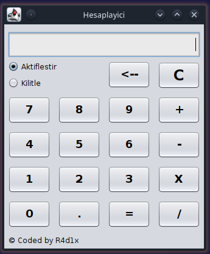
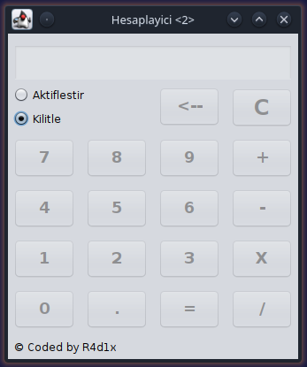

<h1 align="center">Hesap Makinesi</h1>

 

  <strong>Javax ile hazirlanmis Hesap Makinesi</strong>
  
  
  
  

 

# Bilgiler
Javax ile hazirlanmis %100 Hesap Makinesi. Egitim amacli hazirlanmistir.

## Temel Gereksinimler:

1- Java IDE (NetBeans kullandim bu Projede)

2- JDK

### Projeyi calistirma ve inceleme:

Projeyi calistirmak icin : Jar dosyasini indirebilirsiniz.

### PR:
Bug yada hata bulmaniz durumunda PR kabul edilir. Simdiden tesekkür ederim :)
